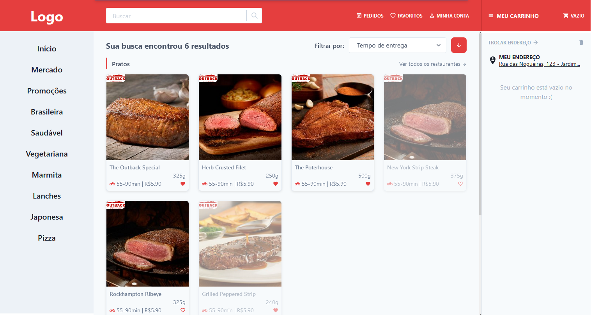

This is a [Next.js](https://nextjs.org/) project bootstrapped with [`create-next-app`](https://github.com/vercel/next.js/tree/canary/packages/create-next-app).

### Visit https://next-food-delivery.vercel.app/

## About

This is a simple food delivery main page to improve my knowledge developing web pages using [Next.js+Typescript](https://nextjs.org/), [Context API](https://reactjs.org/docs/context.html) and [Chakra UI](https://chakra-ui.com/).

## Features

You can add and remove the fixed items displayed on "Pratos" section to the cart.

